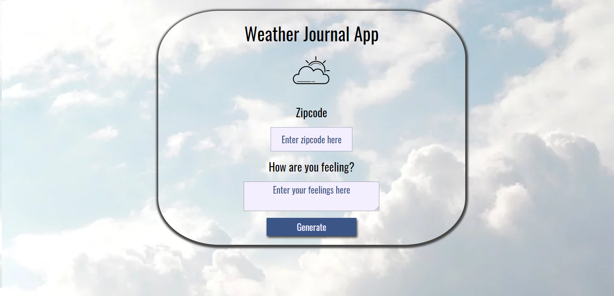

# Weather App Project

This is my third project for Front-end Udacity Nanodegree.
The project is about to create an asynchronous web app that uses a Web API and user data to dynamically update the UI.

This is a Weather Application that allows user to get the actual weather from a place using the zip code from this place. 

## How to start

You need to have Node.js and npm locally installed. You can check that by running `node -v && npm -v` in terminal. This should result in two versions shown in terminal.

Then, you have to run `npm start` in order to run the express server locally.

Open `localhost:8000`in your browser and the app will be running.

## Built With

* [Visual Studio Code](https://code.visualstudio.com/)
* [Udacity Template](https://github.com/udacity/fend/tree/refresh-2019/projects/weather-journal-app)
* [OpenWeatherMap](https://openweathermap.org/)

## Authors

* **Itziar Urbieta** (https://github.com/ThisIsItz)
